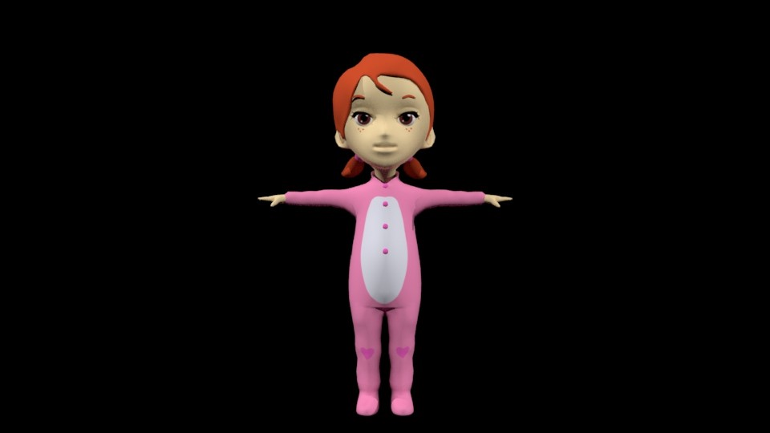
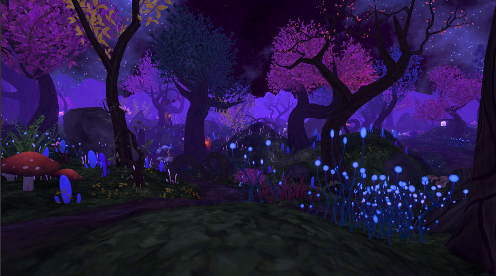
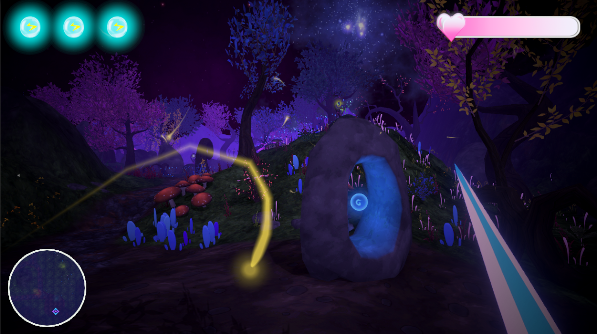

# Demo Juego PC: Una Aventura en la Oscuridad (AO)

Una Aventura en la Oscuridad es un juego demo de PC en el que el personaje prinicipal, Sam, usando su imagación lograra explarar afrontar su mayor miedo, la oscuridad.
Este juego demo fue desarrollado como proyecto de graduación para evaluar los conocimientos y habilidades de los estudiantes de la carrera de Ingeniería en Tecnología Interactiva en Animación Digital (ITIAD).

## Descripción

En este juego, los jugadores toman el control de una niña que debe navegar a través de un diferente escanrios siendo el primero nivel, el bosque de colores. A lo largo del camino, la protagonista enfrentará diversos obstáculos para avanzar. El juego combina elementos de aventura, ofreciendo una experiencia inmersiva para los jugadores.

## Características

- **Exploración del Bosque**: Navega a través de diferentes del bosque que es un laberinto a su vez.
- **Historia Envolvente**: Descubre la historia detrás de la niña y su misión a medida que avanzas en el juego.
- **Gráficos Detallados**: Disfruta de un entorno de juego visualmente atractivo con gráficos detallados y efectos visuales impresionantes.

## Primer Nivel – El Bosque de Colores

- **Misión**: Encontrar la salida.
- El jugador deberá escoger por qué camino ir. Cada camino tiene enemigos; sin embargo, varía la cantidad de estos así como la cantidad de ítems de energía y vida.
- Tiene como arma una espada de luz para luchar contra las criaturas malignas de la oscuridad que invaden esta tierra.
- El jugador tiene 3 esferas de energía que indican su estamina. Conforme pasa el tiempo, se remueven una a una, afectando su velocidad al caminar y correr, por lo que el usuario deberá encontrar el ítem de energía para recargar.
- El jugador contará con una barra de vida, la cual puede recargar encontrando el ítem de vida.
- Sam deberá pasar por diferentes tierras para poder llegar a la meta final: el oasis.

## Requisitos del Proyecto

El desarrollo de este juego debía cumplir con los siguientes requisitos establecidos para el proyecto de graduación:

- **Guion/GDD (Game Design Document)**

- **Diseño de Personaje**:
  - 2D (Turnaround)
  - 3D (Modelado, rigging)

- **Diseño y Modelado de Props y Escenario**:
  - 2D y 3D

- **Storyboard y Animatic**

- **Integración en Unity**:
  - El personaje debe interactuar con enemigos, props y escenario

- **Integración de Partículas, Efectos, y Sonidos**

## Imágenes del Juego

Aquí hay algunas capturas de pantalla del juego en acción:

### Personaje 3D (Sam)

### Escenario (Bosque de Colores)

### HUD

## Video Demo

Consulta el video demo del juego en YouTube para ver el juego en acción: [Ver el Demo](https://youtu.be/jf2sO-thhhg)

## Licencia

Este proyecto está licenciado bajo la Licencia MIT - vea el archivo [LICENSE](LICENSE) para más detalles.
